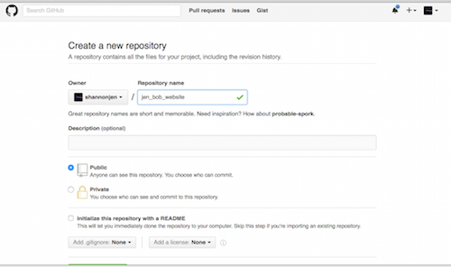
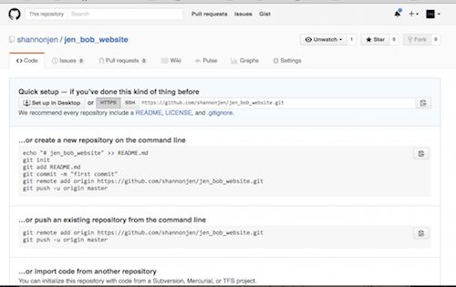
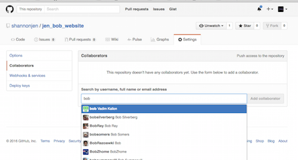
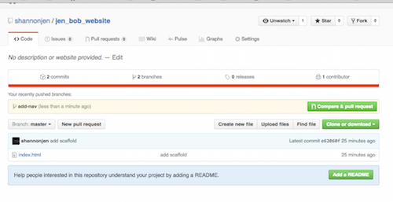
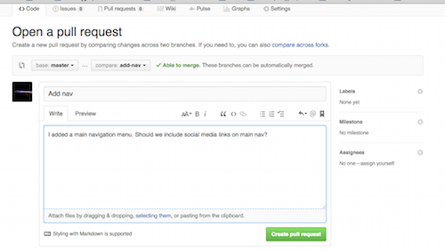
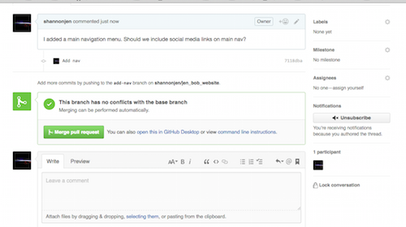
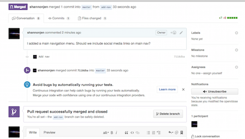

#GitHub Centralized Repository Workflow

I am working with my partner, Bob. We are going to build a website collaboratively and plan to use a GitHub repo as a central repository. We will create and work on feature branches locally on our machine.

On my local machine, I make a folder called jen_bob_website that will hold the files and folders of the project. I add a basic index.html file with simple HTML scaffolding to the folder. 

From within the jen_bob_website folder I initialize the folder as a git repository. 

```
$ git init
```

I do this only once. This initialization will generate a hidden folder where all of the git magic will be stored. Git will allow me to do many things, including: 
*	take snapshots (commits) of my code as I progress 
* make branches 
* push my code to a remote server (like GitHub)

My git repository is empty. My folder is not. I need to add my files (file in this case) to the staging area and make my first commit. 

```
$ git add -A
$ git commit -m “Initial Commit”
```

Now I have a folder set up with a git repository on my machine. Next, I’d like to push the repository to GitHub. 

####GITHUB GUI
I create a new repository on GitHub. 



This generates a unique URL - a location on GitHub for me to push the local repository from my machine. 



####MY MACHINE
I am going to add this empty GitHub repository URL as a remote and we are going to give it a name of origin.

```
$ git remote add origin https://github.com/shannonjen/jen_bob_website.git
```

Next I am going to push my local master branch to the GitHub repository (origin). I use the -u  flag to set the upstream. This sets up the association between the master branch on my local machine and the master branch on origin (the GitHub repo). I will only need to type git push in future pushes.

```
$ git push -u origin master
```

Now we have our centralized production master on GitHub. 

####GITHUB GUI
I make Bob a collaborator on the GitHub repo...



This will allow him to push and pull. 

We will work on feature branches on our local machines, push them to GitHub, and use pull requests on GitHub. 

I am going to add a navigation menu to index.html and bob is going to add some welcome text and an image.

####BOB'S MACHINE
Bob clones the GitHub repository onto his machine and creates and checks out a branch called add-welcome.

```
$ git clone https://github.com/shannonjen/jen_bob_website.git
$ cd jen_bob_website
$ git checkout -b add-welcome
```

He makes changes and commits the code.

```
$ git add -A
$ git commit -m “Add welcome”
```

He is still working…

Meanwhile, I...

####MY MACHINE

I make a branch called add-nav on my machine

```
$ git checkout -b add-nav
```

I make the changes to my code and then commit

```
$ git add -A
$ git commit -m “Add navigation menu”
```

I’m finished with my work and am ready to have it pulled into the master branch. I push my add-nav branch to GitHub, setting the upstream for this branch with -u...

```
$ git push -u origin add-nav
```

####GITHUB GUI
...and make a pull request on GitHub. 







Bob gets my request and stops what he is doing. He is going to merge my add-nav into the master branch on GitHub (the central repository). If there aren't any conflicts, he can use the GitHub GUI, but running things locally will allow him to check and test the code. 

####BOB'S MACHINE
First he needs to checkout his local master, update it (pull the GitHub master into his local master), and then pull the add-nav from GitHub into his newly updated master. 

```
$ git checkout master
$ git pull
$ git pull origin add-nav
```

Now the updated master is ready to be pushed to origin

```
$ git push
```

This will close the pull request on GitHub.




Now Bob goes back to finishing the work on his local branch

```
$ git checkout add-welcome
```

When he is finished and ready to make a pull request, he will make sure he has committed all of the changes on the add-welcome branch on his machine and then push this branch to the GitHub repo (origin)

```
$ git push -u origin add-welcome
```

####GITHUB GUI
Then he will make a pull request on GitHub.


####Merge Conflicts 
Merge conflicts arise when git is unable auto merge. Git generates lines on the affected files that outline the conflict. 

Ex.
```
<!DOCTYPE html>
<html lang="en">
<head>
	<meta charset="UTF-8">
	<title>Document</title>
</head>
<body>
<<<<<<< HEAD
	<nav>
		<ul>
			<li><a href="#">Home</a></li>
			<li><a href="#">About</a></li>
			<li><a href="#">Contact</a></li>
		</ul>
	</nav>
	
||||||| merged common ancestors
	
=======
	<h1>Welcome</h1>
>>>>>>> 4e813e399aeb3ec3e4392f2822ce39a327f23b56
</body>
</html>
``` 

They are resolved by editing problem file(s) and making a commit. The problem file(s) may open in vim, a command line text editor, by default. You can either use vim or exit vim by pressing escape and entering

```
:q!
```

You will need to open the problem files with a text editor of your choice, fix the code, and commit the changes. 

To read more about this workflow and other workflows, checkout:

[Comparing Workflows](https://www.atlassian.com/git/tutorials/comparing-workflows)
